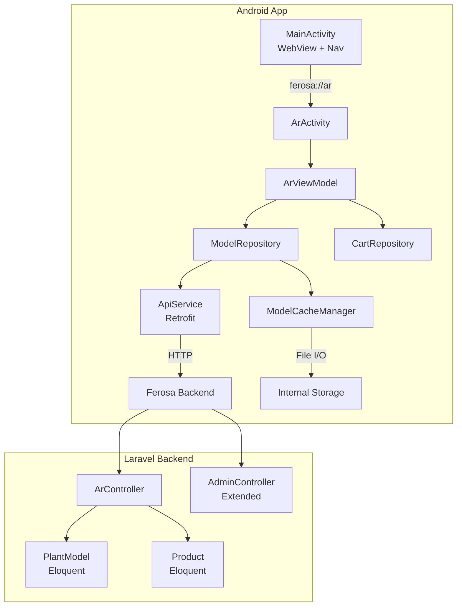

# Design Document: Mobile AR Plant Placement

## Overview

This design describes the upgrade of the existing Ferosa Android AR experience (`ArActivity.kt`) from a hardcoded demo with sample GLB URLs to a fully integrated product visualization system. The existing app already has a working AR implementation using SceneView ARSceneView v2.2.1 with Jetpack Compose, tap-to-place mechanics, a model picker strip, and screenshot capture. This upgrade adds:

1. **Backend API integration** — Replace hardcoded `GARDEN_MODELS` list with products fetched from the Laravel backend via Retrofit/OkHttp
2. **Model caching** — Download GLB files from the backend and cache them locally with LRU eviction
3. **Improved drag-and-drop** — Replace the current "long-press selects last item, tap to relocate" with proper raycasting-based selection and real-time drag along surfaces
4. **Product info overlay with Add to Cart** — Show product details and allow cart addition via API
5. **Placement limit (5 models)** and **delete action** for placed models
6. **Device compatibility check** — Use `ArCoreApk.checkAvailability()` before showing AR UI
7. **Laravel backend additions** — New `ArController`, `plant_models` migration, admin model upload page, and REST API endpoints

### Key Design Decision: Incremental Refactor

Rather than rewriting ArActivity from scratch, we refactor it into a ViewModel-driven architecture while preserving the existing Compose UI patterns, SceneView integration, and screenshot functionality. The existing `GardenModel` data class evolves into an API-backed `ArProduct` model.

## Architecture

### High-Level Architecture



### Existing Code Changes

| File | Change Type | Description |
|------|-------------|-------------|
| `ArActivity.kt` | **Major refactor** | Remove hardcoded `GARDEN_MODELS`, inject `ArViewModel`, wire Compose UI to ViewModel state |
| `Constants.kt` | **Minor edit** | Add `API_BASE_URL` constant derived from `SERVER_URL` |
| `build.gradle.kts` | **Add dependencies** | Retrofit, OkHttp, Gson, Coil, Lifecycle ViewModel |
| `libs.versions.toml` | **Add versions** | Version catalog entries for new dependencies |
| `AndroidManifest.xml` | **Minor edit** | Add `ACCESS_NETWORK_STATE` permission for connectivity check |

### New Android Files

| File | Purpose |
|------|---------|
| `data/api/ApiService.kt` | Retrofit interface defining backend endpoints |
| `data/api/AuthInterceptor.kt` | OkHttp interceptor adding session token to all requests |
| `data/api/models/ArProductDto.kt` | API response DTOs |
| `data/repository/ModelRepository.kt` | Coordinates API fetch + cache for 3D models |
| `data/repository/CartRepository.kt` | Add-to-cart API operations |
| `data/cache/ModelCacheManager.kt` | LRU file cache for GLB models (200MB limit) |
| `ui/ar/ArViewModel.kt` | ViewModel managing AR session state, product list, placement |
| `ui/ar/ArProductState.kt` | UI state classes for the AR screen |
| `ui/ar/components/ProductInfoPanel.kt` | Compose overlay showing product details + Add to Cart |
| `ui/ar/components/CatalogDrawer.kt` | Refactored model picker strip loading from API |
| `util/ConnectivityMonitor.kt` | Network state observer |
| `util/ArCompatibilityChecker.kt` | Wraps ArCoreApk.checkAvailability() |

### New Laravel Files

| File | Purpose |
|------|---------|
| `app/Http/Controllers/ArController.php` | REST API: list AR products, serve models, add to cart |
| `app/Models/PlantModel.php` | Eloquent model for `plant_models` table |
| `database/migrations/xxxx_create_plant_models_table.php` | Migration for AR model storage |
| `resources/views/admin/partials/ar-models.blade.php` | Admin panel section for 3D model upload |
| `routes/api.php` | API routes for AR endpoints |

## Components and Interfaces

### Android Components

#### ApiService (Retrofit Interface)

```kotlin
interface ApiService {
    @GET("api/ar/products")
    suspend fun getArProducts(): List<ArProductDto>

    @GET("api/ar/products/{id}/model")
    @Streaming
    suspend fun downloadModel(@Path("id") productId: Int): ResponseBody

    @POST("api/cart/add")
    suspend fun addToCart(@Body request: AddToCartRequest): CartResponse

    @GET("api/ar/products/{id}/model-info")
    suspend fun getModelInfo(@Path("id") productId: Int): ModelInfoDto
}
```

#### AuthInterceptor

```kotlin
class AuthInterceptor(private val tokenProvider: () -> String?) : Interceptor {
    override fun intercept(chain: Interceptor.Chain): Response {
        val token = tokenProvider()
        val request = chain.request().newBuilder().apply {
            token?.let { addHeader("Authorization", "Bearer $it") }
            addHeader("Accept", "application/json")
        }.build()
        return chain.proceed(request)
    }
}
```

#### ModelCacheManager

```kotlin
class ModelCacheManager(private val context: Context) {
    companion object {
        const val MAX_CACHE_SIZE_BYTES = 200L * 1024 * 1024 // 200 MB
        const val CACHE_VALIDITY_DAYS = 7L
    }

    data class CacheEntry(
        val productId: Int,
        val filePath: String,
        val downloadedAt: Long,  // epoch millis
        val fileSize: Long,
        val lastAccessedAt: Long // for LRU
    )

    suspend fun getCachedModel(productId: Int): File?
    suspend fun cacheModel(productId: Int, data: ByteArray): File
    suspend fun isFresh(productId: Int): Boolean
    suspend fun evictLRU(requiredSpace: Long)
    suspend fun getTotalCacheSize(): Long
    suspend fun getCachedProductIds(): Set<Int>
    suspend fun clearCache()
}
```

#### ArViewModel

```kotlin
class ArViewModel(
    private val modelRepository: ModelRepository,
    private val cartRepository: CartRepository,
    private val cacheManager: ModelCacheManager,
    private val connectivityMonitor: ConnectivityMonitor
) : ViewModel() {

    // State
    val products: StateFlow<List<ArProduct>>
    val selectedProduct: StateFlow<ArProduct?>
    val placedModels: StateFlow<List<PlacedModel>>
    val isLoading: StateFlow<Boolean>
    val error: StateFlow<ArError?>
    val isOffline: StateFlow<Boolean>
    val repositioningModel: StateFlow<PlacedModel?>
    val selectedInfoModel: StateFlow<PlacedModel?>

    // Actions
    fun loadProducts()
    fun selectProduct(product: ArProduct)
    fun placeModel(anchorNode: AnchorNode, product: ArProduct)
    fun deleteModel(placed: PlacedModel)
    fun startRepositioning(placed: PlacedModel)
    fun finishRepositioning(newAnchor: AnchorNode)
    fun cancelRepositioning()
    fun addToCart(product: ArProduct)
    fun showProductInfo(placed: PlacedModel)
    fun dismissProductInfo()

    // Invariant: placedModels.size <= 5
    val canPlace: StateFlow<Boolean>
}
```

#### ArProduct (replaces GardenModel)

```kotlin
data class ArProduct(
    val id: Int,
    val name: String,
    val price: Double,
    val thumbnailUrl: String,
    val modelUrl: String,
    val heightCm: Float,      // admin-configured real-world height
    val category: String,
    val description: String,
    val inStock: Boolean,
)
```

#### PlacedModel

```kotlin
data class PlacedModel(
    val id: String,           // UUID for tracking
    val product: ArProduct,
    val anchorNode: AnchorNode,
    val modelNode: ModelNode,
    val originalAnchor: AnchorNode? = null  // stored during repositioning for snap-back
)
```

### Laravel Components

#### ArController

```php
class ArController extends Controller
{
    // GET /api/ar/products - List AR-enabled products
    public function index(): JsonResponse
    {
        $products = Product::whereHas('plantModel')
            ->whereNull('archived_at')
            ->where('is_active', true)
            ->with('plantModel:id,product_id,file_path,height_cm,file_size')
            ->get(['id', 'name', 'description', 'image_url', 'price', 'category']);

        return response()->json($products->map(fn ($p) => [
            'id'            => $p->id,
            'name'          => $p->name,
            'description'   => $p->description,
            'price'         => (float) $p->price,
            'thumbnail_url' => $p->image_url,
            'model_url'     => route('api.ar.model', $p->id),
            'height_cm'     => $p->plantModel->height_cm,
            'category'      => $p->category,
            'in_stock'      => $p->inStock(),
        ]));
    }

    // GET /api/ar/products/{id}/model - Download GLB file
    public function downloadModel(Product $product): StreamedResponse|JsonResponse

    // GET /api/ar/products/{id}/model-info - Model metadata (for cache freshness check)
    public function modelInfo(Product $product): JsonResponse

    // POST /api/cart/add - Add product to cart
    public function addToCart(Request $request): JsonResponse
}
```

#### PlantModel (Eloquent)

```php
class PlantModel extends Model
{
    protected $fillable = [
        'product_id',
        'file_path',     // storage path to GLB file
        'file_name',     // original filename
        'file_size',     // bytes
        'height_cm',     // real-world height for scaling
        'updated_at',    // used for cache invalidation
    ];

    public function product(): BelongsTo
    {
        return $this->belongsTo(Product::class);
    }
}
```

#### Migration: `create_plant_models_table`

```php
Schema::create('plant_models', function (Blueprint $table) {
    $table->id();
    $table->foreignId('product_id')->unique()->constrained()->cascadeOnDelete();
    $table->string('file_path');
    $table->string('file_name');
    $table->unsignedBigInteger('file_size'); // bytes
    $table->decimal('height_cm', 6, 1);     // 1-500 cm
    $table->timestamps();
});
```

#### API Routes (`routes/api.php`)

```php
Route::middleware('auth:sanctum')->prefix('ar')->group(function () {
    Route::get('/products', [ArController::class, 'index']);
    Route::get('/products/{product}/model', [ArController::class, 'downloadModel'])->name('api.ar.model');
    Route::get('/products/{product}/model-info', [ArController::class, 'modelInfo']);
});

Route::middleware('auth:sanctum')->post('/cart/add', [ArController::class, 'addToCart']);
```

### Gesture Handling Upgrade

The current implementation uses a `GestureDetectorCompat` that:
- **Single tap** → places new model OR relocates selected model
- **Long press** → selects the LAST placed element (no raycasting)

The upgraded implementation:

```kotlin
// New gesture handling approach in ArActivity
val gestureHandler = object : GestureDetector.SimpleOnGestureListener() {

    override fun onSingleTapUp(e: MotionEvent): Boolean {
        val hitResult = sceneView.hitTestAR(e.x, e.y)

        // Check if tap hit a placed model (raycast against model nodes)
        val tappedModel = findPlacedModelAtPosition(e.x, e.y)

        return when {
            // Tap on placed model → show info panel
            tappedModel != null && !viewModel.isRepositioning -> {
                viewModel.showProductInfo(tappedModel)
                true
            }
            // Tap on surface with model loaded → place
            hitResult != null && viewModel.canPlace.value -> {
                placeModelAtHit(hitResult)
                true
            }
            else -> false
        }
    }

    override fun onLongPress(e: MotionEvent) {
        // Raycast to find which specific model was long-pressed
        val tappedModel = findPlacedModelAtPosition(e.x, e.y)
        if (tappedModel != null) {
            viewModel.startRepositioning(tappedModel)
        }
    }
}

// Real-time drag during repositioning
override fun onTouchEvent(event: MotionEvent): Boolean {
    if (viewModel.repositioningModel.value != null) {
        when (event.action) {
            MotionEvent.ACTION_MOVE -> {
                val hit = sceneView.hitTestAR(event.x, event.y)
                if (hit != null) {
                    moveModelToHit(hit)
                } else {
                    showModelAtReducedOpacity()
                }
            }
            MotionEvent.ACTION_UP -> {
                val hit = sceneView.hitTestAR(event.x, event.y)
                if (hit != null) {
                    viewModel.finishRepositioning(createAnchorAt(hit))
                } else {
                    viewModel.cancelRepositioning() // snap-back
                }
            }
        }
        return true
    }
    return gestureDetector.onTouchEvent(event)
}
```

The `findPlacedModelAtPosition()` function uses SceneView's built-in node hit-testing to identify which placed model node the user touched, rather than blindly selecting the last placed element.

## Data Models

### Android Data Models

```kotlin
// API Response DTOs
data class ArProductDto(
    val id: Int,
    val name: String,
    val description: String,
    val price: Double,
    @SerializedName("thumbnail_url") val thumbnailUrl: String,
    @SerializedName("model_url") val modelUrl: String,
    @SerializedName("height_cm") val heightCm: Float,
    val category: String,
    @SerializedName("in_stock") val inStock: Boolean,
)

data class AddToCartRequest(
    @SerializedName("product_id") val productId: Int,
    val quantity: Int = 1
)

data class CartResponse(
    val success: Boolean,
    val message: String,
    @SerializedName("cart_count") val cartCount: Int
)

data class ModelInfoDto(
    @SerializedName("updated_at") val updatedAt: String,
    @SerializedName("file_size") val fileSize: Long
)

// Cache metadata (stored as JSON in cache directory)
data class CacheMetadata(
    val entries: MutableMap<Int, CacheEntry> = mutableMapOf()
) {
    data class CacheEntry(
        val productId: Int,
        val fileName: String,
        val downloadedAt: Long,
        val fileSize: Long,
        var lastAccessedAt: Long
    )
}

// UI State
sealed class ArScreenState {
    object Loading : ArScreenState()
    object NoProducts : ArScreenState()
    data class Ready(
        val products: List<ArProduct>,
        val selectedProduct: ArProduct?,
        val placedModels: List<PlacedModel>,
        val isModelLoading: Boolean,
        val isOffline: Boolean,
    ) : ArScreenState()
    data class Error(val message: String, val canRetry: Boolean) : ArScreenState()
}
```

### Laravel Data Models

```
products table (existing):
├── id (bigint, PK)
├── name (string)
├── description (text)
├── image_url (string, nullable)
├── price (decimal 8,2)
├── stock_qty (integer)
├── category (string)
├── is_active (boolean)
├── archived_at (timestamp, nullable)
└── timestamps

plant_models table (NEW):
├── id (bigint, PK)
├── product_id (bigint, FK → products.id, unique)
├── file_path (string) — storage/app/public/ar-models/{filename}
├── file_name (string) — original upload name
├── file_size (bigint) — bytes
├── height_cm (decimal 6,1) — 1.0 to 500.0
└── timestamps
```

### Dependency Additions (Android)

```toml
# libs.versions.toml additions
[versions]
retrofit = "2.11.0"
okhttp = "4.12.0"
gson = "2.11.0"
coil = "2.7.0"
lifecycleViewModel = "2.6.1"

[libraries]
retrofit-core = { group = "com.squareup.retrofit2", name = "retrofit", version.ref = "retrofit" }
retrofit-gson = { group = "com.squareup.retrofit2", name = "converter-gson", version.ref = "retrofit" }
okhttp-core = { group = "com.squareup.okhttp3", name = "okhttp", version.ref = "okhttp" }
okhttp-logging = { group = "com.squareup.okhttp3", name = "logging-interceptor", version.ref = "okhttp" }
gson = { group = "com.google.code.gson", name = "gson", version.ref = "gson" }
coil-compose = { group = "io.coil-kt", name = "coil-compose", version.ref = "coil" }
androidx-lifecycle-viewmodel-compose = { group = "androidx.lifecycle", name = "lifecycle-viewmodel-compose", version.ref = "lifecycleViewModel" }
```

## Correctness Properties

*A property is a characteristic or behavior that should hold true across all valid executions of a system — essentially, a formal statement about what the system should do. Properties serve as the bridge between human-readable specifications and machine-verifiable correctness guarantees.*

### Property 1: Model Scaling Accuracy

*For any* plant model with a given bounding box height and admin-configured target height in centimeters, computing the scale factor and applying it SHALL produce a rendered model height within ±10% of the target height.

**Validates: Requirements 3.2**

### Property 2: Placement Limit Invariant

*For any* sequence of place and delete operations on the AR scene, the number of simultaneously placed models SHALL never exceed 5, and any placement attempt when 5 models are already placed SHALL be rejected without modifying the placed models list.

**Validates: Requirements 4.3, 4.4**

### Property 3: Delete Frees Placement Slot

*For any* non-empty set of placed models, deleting one model SHALL reduce the placed count by exactly 1 and the deleted model SHALL no longer appear in the placed models list.

**Validates: Requirements 4.5**

### Property 4: Product Info Panel Completeness

*For any* AR product with valid name, price, and availability data, the product information panel SHALL contain the product name, formatted price, and an "Add to Cart" action.

**Validates: Requirements 6.1**

### Property 5: AR-Enabled Product Filter

*For any* set of products in the database, the AR product list endpoint SHALL return only products that have an associated plant model, are active, and are not archived — and SHALL never include products without a plant model.

**Validates: Requirements 7.2**

### Property 6: Product Name Truncation

*For any* product name string, when displayed in the catalog drawer, names longer than 25 characters SHALL be truncated to 25 characters followed by an ellipsis ("…"), and names of 25 characters or fewer SHALL be displayed in full without modification.

**Validates: Requirements 7.4**

### Property 7: Model Upload Validation

*For any* uploaded file, the validation SHALL accept the file if and only if it has a `.gltf` or `.glb` extension AND its size does not exceed 10 MB AND it is parseable as a valid glTF 2.0 asset. For rejected files, the error message SHALL identify which specific validation check failed.

**Validates: Requirements 9.2, 9.3**

### Property 8: Height Dimension Validation

*For any* numeric height input, the validation SHALL accept values between 1 and 500 (inclusive) in centimeters, and reject all other values. A product SHALL not be marked AR-enabled without a valid height value set.

**Validates: Requirements 9.5**

### Property 9: Authorization Header Inclusion

*For any* HTTP request sent by the API client to the Ferosa backend, the request SHALL include the user's session token in the Authorization header.

**Validates: Requirements 11.6**

### Property 10: Cache Write with Metadata

*For any* successfully downloaded plant model, caching the model SHALL record the product ID, download timestamp (epoch milliseconds), and file size in bytes as cache metadata, and the file SHALL be retrievable by product ID.

**Validates: Requirements 12.1**

### Property 11: Cache Freshness Decision

*For any* cached model with a recorded download timestamp, if the age is less than 7 days, loading that model SHALL use the cache without a network request. If the age is 7 days or more, the system SHALL check for an update when online.

**Validates: Requirements 12.2, 12.3**

### Property 12: Offline Catalog Shows Only Cached

*For any* set of products and any subset of those products having cached models, when the device is offline, the catalog drawer SHALL display exactly the products whose models are cached locally — no more, no less.

**Validates: Requirements 12.5**

### Property 13: LRU Cache Eviction Maintains Size Limit

*For any* cache state and any new model file to be cached, after the eviction and write operation the total cache size SHALL not exceed 200 MB, and the eviction SHALL remove the least recently accessed entries first until sufficient space is available.

**Validates: Requirements 12.6**

## Error Handling

### Android Error Handling Strategy

| Error Category | Handling | User Experience |
|---|---|---|
| **ARCore unsupported** | Check via `ArCoreApk.checkAvailability()` before showing AR button | "View in AR" button hidden; no error shown |
| **ARCore not installed** | Prompt user to install from Play Store | Install dialog with Play Store link |
| **Camera permission denied** | Show explanation screen (existing implementation) | Permission required message + back button |
| **AR session init failure** | Retry up to 3 times with exponential backoff | Loading → error message → retry button |
| **AR session init timeout** | Abort after 10 seconds | Timeout error message → retry button |
| **Network auth failure** | Show error, offer return to product screen | "Authentication failed" → back button |
| **Product list fetch failure** | Retry up to 3 times; if offline, show cached | Error toast → retry; or offline banner |
| **Model download failure** | Retry up to 3 times; retain previous model on reticle | Error message → retry; previous model kept |
| **All retries exhausted** | Show "model unavailable" with return option | Final error → back to product screen |
| **Add to cart failure** | Show error, keep info panel open | Error toast; panel remains for re-attempt |
| **AR session interrupted** | Show error message with return button | "Session interrupted" → back button |
| **Placement limit reached** | Show toast message, reject placement | "Maximum 5 plants placed" toast |
| **Session cleanup timeout** | Force-release after 5 seconds | Force navigate back to product screen |

### Laravel Error Handling

| Error Category | HTTP Status | Response |
|---|---|---|
| **Unauthenticated** | 401 | `{"error": "Unauthenticated"}` |
| **Product not found** | 404 | `{"error": "Product not found"}` |
| **Product has no model** | 404 | `{"error": "No AR model available for this product"}` |
| **Upload validation failed** | 422 | `{"error": "Validation failed", "details": {"file": ["..."]}}` |
| **File too large** | 422 | `{"error": "File exceeds maximum size of 10 MB"}` |
| **Invalid file format** | 422 | `{"error": "File is not a valid glTF 2.0 asset"}` |
| **Product out of stock** | 422 | `{"error": "Product is out of stock"}` |
| **Server error** | 500 | `{"error": "Internal server error"}` |

### Retry Strategy

All retryable operations use a consistent pattern:
- Maximum 3 attempts
- Exponential backoff: 1s, 2s, 4s delays
- Network errors and 5xx responses are retryable
- 4xx errors (except 401) are NOT retryable (client error)
- 401 triggers re-authentication flow, not simple retry

## Testing Strategy

### Unit Tests (Example-Based)

Unit tests focus on specific scenarios, edge cases, and error conditions:

- **ArViewModel**: Test state transitions (loading → ready → error), placement limit enforcement, repositioning state management
- **ModelCacheManager**: Test cache hit/miss, metadata serialization, file operations
- **AuthInterceptor**: Test header injection with valid/null tokens
- **ArCompatibilityChecker**: Test all ArCoreApk availability states
- **ArController (Laravel)**: Test endpoint responses, validation rules, file handling
- **PlantModel validation**: Test height bounds, file extension checks

### Property-Based Tests

Property-based testing is appropriate for this feature because it contains pure functions with clear input/output behavior (scaling math, validation logic, cache eviction, filtering) and universal invariants (placement limits, authorization headers).

**Library**: [Kotest Property Testing](https://kotest.io/docs/proptest/property-based-testing.html) for Kotlin, [PHPUnit with Faker](https://github.com/spatie/phpunit-snapshot-assertions) for Laravel validation logic.

**Configuration**: Minimum 100 iterations per property test.

**Tag format**: `Feature: mobile-ar-plant-placement, Property {number}: {property_text}`

Properties to implement:
1. Model scaling accuracy (pure math)
2. Placement limit invariant (state machine)
3. Delete frees slot (state transition)
4. Product info panel completeness (data mapping)
5. AR-enabled product filter (query logic)
6. Product name truncation (string function)
7. Model upload validation (validation logic)
8. Height dimension validation (bounds check)
9. Authorization header inclusion (interceptor)
10. Cache write with metadata (data storage)
11. Cache freshness decision (time comparison)
12. Offline catalog shows only cached (set filtering)
13. LRU eviction maintains size limit (algorithm)

### Integration Tests

- AR session lifecycle (init → use → cleanup)
- Full model download → cache → reload cycle
- Add-to-cart end-to-end (Android → API → database)
- Admin upload → API serve → Android download flow
- Offline mode: launch without network, verify cached products only

### Manual Testing

- Physical device AR surface detection quality
- Gesture feel (long-press timing, drag smoothness)
- Visual quality of 3D models at various scales
- Performance under 5 simultaneous models
- Different lighting conditions
